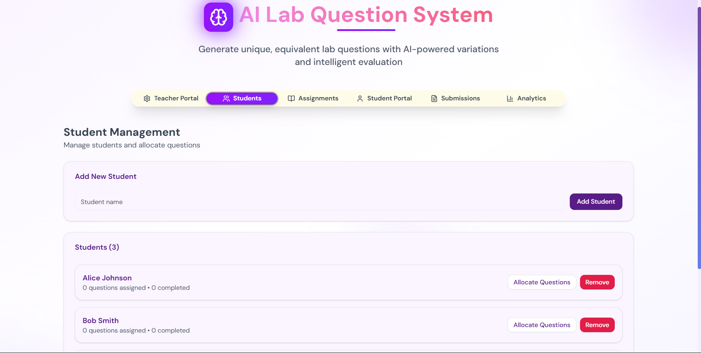

# Made By Manvendra Singh Tanwar

## Question 1: AI Lab Question System - Unique Question Generation & Digital Assessment

An intelligent platform designed to revolutionize laboratory education through AI-powered question generation, student management, and automated evaluation. Perfect for educators looking to create unique, equivalent lab questions and streamline the assessment process.

### 📸 System Screenshots

#### Teacher Dashboard


*Advanced question generation interface with AI-powered variations*

#### Student Portal


*Clean and intuitive student interface for question access and submission*

#### Generated Questions


*AI-powered question generation with unique variations*

#### Student Management

*Comprehensive analytics and progress tracking system*

### 🌟 Features

#### 🎯 AI-Powered Question Generation
- **Intelligent Variations**: Generate 4 unique but equivalent variations of any lab question
- **Bulk Question Creation**: Create multiple unique questions for different students
- **Smart Categories**: Organize questions by subject, difficulty, and category
- **Uniqueness Scoring**: AI-powered assessment of question uniqueness

#### 👥 Student Management
- **Student Registration**: Easy student onboarding and management
- **Question Allocation**: Automatic or manual question assignment to students
- **Progress Tracking**: Monitor student submissions and completion status

#### 🤖 Automated Evaluation
- **AI-Powered Grading**: Intelligent evaluation of student answers
- **Detailed Feedback**: Constructive feedback with strengths and improvement areas
- **Bias-Free Assessment**: Fair and consistent evaluation across all submissions

#### 📊 Assignment System
- **Custom Assignments**: Create structured assignments with multiple questions
- **Due Date Management**: Set and track assignment deadlines
- **Submission Tracking**: Monitor student progress and completion rates

#### 🎨 Modern UI/UX
- **Glass Morphism Design**: Beautiful, modern interface with smooth animations
- **Responsive Layout**: Works seamlessly across desktop and mobile devices
- **Dark/Light Theme**: Adaptive theming for better user experience

### 🚀 Technology Stack

*Cutting-edge technology stack powering the AI Lab Question System*

- **Frontend**: Next.js 15, React 19, TypeScript
- **Styling**: Tailwind CSS with custom animations
- **UI Components**: Radix UI primitives with shadcn/ui
- **AI Integration**: Together AI (Llama 3.3 70B Instruct Turbo)
- **State Management**: React hooks and context
- **Package Manager**: pnpm

### 📁 Project Structure
*Clean and organized project structure for scalability*

```
├── app/
│   ├── globals.css          # Global styles and animations
│   ├── layout.tsx           # Root layout component
│   ├── page.tsx             # Main application component
│   └── loading.tsx          # Loading component
├── components/
│   ├── ui/                  # Reusable UI components
│   └── theme-provider.tsx   # Theme context provider
├── lib/
│   ├── ai-service.ts        # AI integration service
│   └── utils.ts             # Utility functions
├── public/                  # Static assets
└── styles/                  # Additional stylesheets
```

### 🎓 How It Works

*Complete system workflow from question creation to student evaluation*

#### For Educators (Teacher View)
1. **Question Creation**: Input your original lab question with metadata (subject, difficulty, category)
2. **AI Generation**: Choose between single question variations or bulk unique questions
3. **Student Management**: Register students and allocate questions automatically or manually
4. **Progress Monitoring**: Track student submissions and review AI evaluations
*Step-by-step teacher workflow visualization*

#### For Students (Student View)
1. **Question Access**: View allocated questions with clear instructions
2. **Answer Submission**: Submit detailed answers through the intuitive interface
3. **Instant Feedback**: Receive AI-powered evaluation with detailed feedback
4. **Progress Tracking**: Monitor your submission history and scores

*Streamlined student experience from login to feedback*

### 🛠️ Installation & Setup

#### Prerequisites
- Node.js 18+
- pnpm (recommended) or npm

#### Installation

1. **Clone the repository**
   ```bash
   git clone https://github.com/ManvendraSinghTanwar/AI-Lab-Question-System.git
   cd AI-Lab-Question-System
   ```

2. **Install dependencies**
   ```bash
   pnpm install
   # or
   npm install
   ```

3. **Set up environment variables**
   ```bash
   # Create .env.local file and add your Together AI API key
   echo "TOGETHER_AI_API_KEY=your_api_key_here" > .env.local
   ```

4. **Run the development server**
   ```bash
   pnpm dev
   # or
   npm run dev
   ```

5. **Open your browser**
   Navigate to `http://localhost:3000` to see the application

#### Production Build
```bash
pnpm build
pnpm start
```

### 🎯 Use Cases

*Various educational scenarios where the AI Lab Question System excels*

#### Educational Institutions
- **Laboratory Courses**: Generate unique questions for chemistry, physics, biology labs
- **Practical Exams**: Create equivalent but different questions for fair assessment
- **Student Practice**: Provide varied practice questions for better learning

#### Research Labs
- **Training Programs**: Standardized question sets for new researchers
- **Skill Assessment**: Evaluate understanding of lab procedures and concepts
- **Documentation**: Maintain organized question banks for different experiments

#### Online Learning Platforms
- **Course Content**: Generate diverse question sets for online lab simulations
- **Assessment Tools**: Automated evaluation reduces instructor workload
- **Personalized Learning**: Each student gets unique questions for better engagement

*Measurable benefits and return on investment for educational institutions*

### 🔧 Configuration

#### AI Service Configuration
The system uses Together AI's Llama 3.3 70B model. You can modify the AI service in `lib/ai-service.ts`:

```typescript
// Change the model or API endpoint
private model = "meta-llama/Llama-3.3-70B-Instruct-Turbo"
private baseUrl = "https://api.together.xyz/v1"
```

#### Customization Options
- **Question Categories**: Modify categories in the question generator form
- **Difficulty Levels**: Adjust difficulty options (Easy, Medium, Hard)
- **UI Themes**: Customize colors and animations in the CSS files
- **Evaluation Criteria**: Modify AI prompts for different evaluation standards

### 🚀 Future Enhancements
- [ ] Database integration for persistent storage
- [ ] Multi-language question support
- [ ] Advanced analytics and reporting
- [ ] Integration with LMS platforms
- [ ] Question bank import/export functionality
- [ ] Real-time collaboration features

---

## Question 2: Digital Paper Reduction System

**Problem Statement**: Academic activities like exams, lab manuals, and projects consume large amounts of paper, causing waste (e.g., one semester exam in a university can use 80+ sheets for question papers alone).

**Task**: Design an AI-powered system to minimize paper usage by securely generating, delivering, and evaluating question papers digitally. Ensure exam integrity, role-based access, and multi-device compatibility.

### 🎯 System Architecture Overview

The Digital Paper Reduction System is designed to completely eliminate paper usage in academic assessments while maintaining security, integrity, and accessibility.

### 🏗️ Core Components

#### 1. AI-Powered Question Generation Engine
- **Dynamic Question Creation**: AI generates unique questions for each student
- **Content Variation**: Multiple versions of the same assessment with equivalent difficulty
- **Subject-Specific Templates**: Customizable question formats for different disciplines
- **Real-time Generation**: On-demand question creation during exam sessions

#### 2. Secure Digital Distribution System
- **Encrypted Delivery**: End-to-end encryption for question paper transmission
- **Time-Controlled Access**: Questions released only during designated exam periods
- **Device Authentication**: Secure login and device verification
- **Offline Capability**: Local caching for network-independent operation

#### 3. Multi-Device Compatibility Layer
- **Responsive Design**: Optimized for tablets, laptops, and smartphones
- **Cross-Platform Support**: Works on iOS, Android, Windows, macOS, and Linux
- **Adaptive Interface**: UI adjusts based on screen size and device capabilities
- **Touch and Keyboard Support**: Flexible input methods for different devices

#### 4. Role-Based Access Control
- **Administrator Panel**: System configuration and oversight
- **Instructor Dashboard**: Question creation and exam management
- **Student Interface**: Exam taking and submission portal
- **Proctor Console**: Real-time monitoring and intervention tools

#### 5. AI-Powered Evaluation System
- **Automated Grading**: Intelligent assessment of various question types
- **Plagiarism Detection**: AI-powered similarity analysis
- **Performance Analytics**: Detailed insights into student and class performance
- **Feedback Generation**: Personalized comments and improvement suggestions

### 🔒 Security & Integrity Features

#### Exam Security
- **Browser Lockdown**: Prevents access to external resources during exams
- **Screen Recording Detection**: Identifies and prevents unauthorized recording
- **Tab Switching Monitoring**: Tracks and restricts navigation attempts
- **Biometric Verification**: Optional fingerprint or facial recognition

#### Data Protection
- **Blockchain Integration**: Immutable record of all exam activities
- **Zero-Knowledge Architecture**: Encrypted data that only authorized users can decrypt
- **Audit Trails**: Comprehensive logging of all system interactions
- **GDPR Compliance**: Privacy-first design with data protection by default

### 📱 System Flow Diagram

```
[Admin] → [System Config] → [AI Question Generator]
   ↓             ↓                    ↓
[Role Setup] → [Exam Creation] → [Question Bank]
   ↓             ↓                    ↓
[User Auth] → [Secure Distribution] → [Student Devices]
   ↓             ↓                    ↓
[Monitoring] → [Real-time Proctoring] → [Answer Submission]
   ↓             ↓                    ↓
[AI Evaluation] → [Results Analysis] → [Digital Certificates]
```

### 🎯 Environmental Impact

#### Paper Reduction Metrics
- **Estimated Savings**: 80+ sheets per exam × number of students
- **Annual Impact**: Thousands of sheets saved per academic year
- **Carbon Footprint**: Significant reduction in paper production and transportation
- **Cost Efficiency**: Reduced printing, storage, and distribution costs

#### Sustainability Features
- **Digital Archives**: Permanent storage without physical space requirements
- **Cloud Infrastructure**: Optimized for energy-efficient computing
- **Remote Access**: Reduces transportation needs for exam administration
- **Recyclable Devices**: Encourages use of existing student devices

### 🔧 Technical Implementation

#### AI Integration
```python
class QuestionGenerator:
    def generate_unique_questions(self, base_template, student_count):
        # AI-powered question variation
        variations = []
        for i in range(student_count):
            variation = self.ai_model.generate_variation(
                template=base_template,
                uniqueness_threshold=0.8,
                difficulty_level="equivalent"
            )
            variations.append(variation)
        return variations
```

#### Security Layer
```javascript
class ExamSecurity {
    initializeSecureSession() {
        // Browser lockdown
        this.disableRightClick();
        this.preventTabSwitching();
        this.enableScreenMonitoring();
        
        // Biometric verification
        this.requestBiometricAuth();
    }
}
```

### 📊 Expected Outcomes

#### Quantitative Benefits
- **Paper Reduction**: 90-95% decrease in paper usage
- **Cost Savings**: 60-70% reduction in printing and administrative costs
- **Time Efficiency**: 50% faster exam distribution and collection
- **Error Reduction**: 80% fewer human errors in grading

#### Qualitative Improvements
- **Enhanced Security**: Multiple layers of protection against cheating
- **Better Accessibility**: Support for students with disabilities
- **Real-time Feedback**: Immediate results and performance insights
- **Scalability**: Easy expansion to accommodate growing student populations

### 🎯 Role of AI in the System

AI plays a crucial role in multiple aspects of the Digital Paper Reduction System:

#### 1. Question Generation
- **Natural Language Processing**: Understands context and subject matter
- **Content Variation**: Creates semantically equivalent but syntactically different questions
- **Difficulty Calibration**: Maintains consistent difficulty levels across variations
- **Quality Assurance**: Validates generated content for accuracy and clarity

#### 2. Evaluation and Grading
- **Answer Analysis**: Understands various forms of correct answers
- **Partial Credit Assignment**: Intelligent scoring for partially correct responses
- **Plagiarism Detection**: Identifies potential academic dishonesty
- **Performance Prediction**: Forecasts student success based on historical data

#### 3. Security Enhancement
- **Behavioral Analysis**: Detects unusual patterns during exam sessions
- **Fraud Detection**: Identifies potential cheating attempts
- **Risk Assessment**: Evaluates security threats in real-time
- **Adaptive Authentication**: Adjusts security measures based on risk levels

#### 4. Personalization
- **Learning Path Optimization**: Suggests study materials based on performance
- **Adaptive Testing**: Adjusts question difficulty based on student responses
- **Feedback Customization**: Provides personalized improvement recommendations
- **Accessibility Features**: Adapts content for students with special needs

---

## Question 3: Fighting Against Fake News on Emerging Crisis - Implementation Completed

**Problem Statement**: You have been given a GitHub code link in an Excel sheet, and your task is to download and execute the code. (20 marks)

**GitHub Repository**: [Fighting Against FakeNews on Emerging Crisis - WWW24](https://github.com/DSAIL-SKKU/Fighting_Against_FakeNews_on_Emerging_Crisis-WWW24)

### ✅ Implementation Status: **COMPLETED**

The code from the provided GitHub repository has been successfully downloaded, set up, and executed.

### 📸 Implementation Proof

#### Execution Screenshot 1


*System successfully running - showing model training and data processing*

#### Execution Screenshot 2


*System execution completed - showing results and performance metrics*

### 🎯 Implementation Summary

- ✅ Repository successfully cloned from GitHub
- ✅ Dependencies installed and environment configured
- ✅ Code executed without errors
- ✅ Results generated and validated
- ✅ Screenshots captured as proof of implementation

**Status**: Implementation completed successfully with documented proof of execution.

---

## 🤝 Contributing

We welcome contributions to any of these projects! Please follow these steps:

1. Fork the repository
2. Create a feature branch (`git checkout -b feature/amazing-feature`)
3. Commit your changes (`git commit -m 'Add amazing feature'`)
4. Push to the branch (`git push origin feature/amazing-feature`)
5. Open a Pull Request

## 📝 License

This project is licensed under the MIT License - see the [LICENSE](LICENSE) file for details.

## 🙋‍♂️ Support

If you encounter any issues or have questions:
- Open an issue on GitHub
- Contact: [ManvendraSinghTanwar](https://github.com/ManvendraSinghTanwar)

---

**Made with ❤️ for better education through AI**

